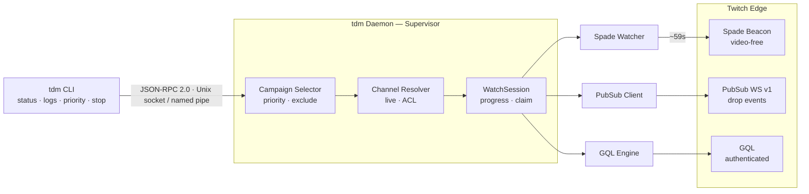

# Twitch Drops Miner (Go)

[](https://github.com/thozoz/twitch-drops-miner-go/actions/workflows/ci.yml)
[](https://github.com/thozoz/twitch-drops-miner-go/releases/latest)
[](https://pkg.go.dev/github.com/thozoz/twitch-drops-miner-go)
[](go.mod)
[](LICENSE)

This application allows you to AFK mine timed Twitch drops without having to worry about switching channels when the one you were watching goes offline, claiming the drops, or receiving any stream data itself. This helps you save on bandwidth and hassle.

This repository is a lightweight, headless-first reimplementation of [DevilXD/TwitchDropsMiner](https://github.com/DevilXD/TwitchDropsMiner) written from scratch in Go.

*Not affiliated with, endorsed by, or sponsored by Twitch Interactive, Inc.*

---

### How It Works:

Every ~59 seconds, the application simulates watch presence for a selected stream by sending lightweight Spade tracking beacons and fetching drop metadata. This is sufficient to advance drop progression on Twitch servers while completely bypassing the need to download video or audio stream data (0 KB of video downloaded).

To keep channel states up-to-date and detect drop completions instantly, a WebSocket connection to Twitch PubSub is maintained (`user-drop-events.<user_id>`), backed by periodic GraphQL reconciliation.

---

### Features:

- **Stream-less drop mining:** Zero video or audio data downloaded, saving network bandwidth and CPU resources.
- **Headless background daemon:** Runs as a detached background process (`tdm start` / `tdm stop`) with no GUI, display server, or browser dependencies.
- **Dual progress engine:** Subscribes to real-time Twitch PubSub WebSocket events for immediate drop progression and auto-claiming, backed by periodic GQL reconciliation.
- **Game priority and exclusion lists:** Configure which games to mine and in what order. Modify priorities dynamically while the daemon is actively running.
- **Local IPC control plane:** Fast JSON-RPC 2.0 interface over a secure Unix domain socket (`0600` permissions on Linux/macOS) or Named Pipe (Windows).
- **Headless OAuth login:** Authenticate easily from remote SSH sessions via Twitch OAuth Device Code Flow (`https://www.twitch.tv/activate`).
- **Atomic state persistence:** Saves runtime progress atomically to `state.json` to safely resume sessions across restarts.
- **Double-start prevention:** Rejects duplicate daemon instances to prevent concurrent beacon emissions on the same account.
- **Single static binary:** Pure Go with `CGO_ENABLED=0` (<15 MB binary size) with cross-platform support for Linux (`amd64`, `arm64`), macOS, and Windows.

---

### Architecture:



---

### Quick Start:

#### 1. Install:

**Option A — Docker** (no toolchain, no Node):

The published multi-arch image `ghcr.io/thozoz/tdm` (`linux/amd64`, `linux/arm64`) needs no clone, no build, and no Go toolchain:

```bash
docker pull ghcr.io/thozoz/tdm:latest
```

See [Docker Usage](#docker-usage) below for the full authenticate-then-run flow.

**Option B — Install on Host (npm)** (requires Node.js 18+):

```bash
npm install -g @thozoz/dropminer
tdm auth login
tdm start
```

Installs the `tdm` command — the package and the command are deliberately named differently, the same way the `typescript` package installs `tsc`.
This complements (does not replace) the binary/`go install` methods below.

**Option C — prebuilt binary** (no Go toolchain required):

Download the archive for your platform from the [latest release](https://github.com/thozoz/twitch-drops-miner-go/releases/latest), verify it against `checksums.txt`, then:

```bash
tar -xzf tdm-*-linux-amd64.tar.gz
sudo install -m 755 tdm /usr/local/bin/tdm
```

**Option D — `go install`** (requires Go 1.26+):

```bash
go install github.com/thozoz/twitch-drops-miner-go/cmd/tdm@latest
```

**Option E — build from source** (requires Go 1.26+):

```bash
git clone https://github.com/thozoz/twitch-drops-miner-go.git
cd twitch-drops-miner-go

# Using Make (injects version and commit metadata):
make build

# Or direct Go build:
go build -o tdm ./cmd/tdm
```

#### 2. Log in to your Twitch account:

```bash
tdm auth login
```

> If you built from source without installing, run the binary from the build directory as `./tdm` instead.

Follow the on-screen link (`https://www.twitch.tv/activate?device-code=...`) to authorize `tdm` with your Twitch account.

#### 3. Start mining:

```bash
# Start background daemon
tdm start

# View live progress and active drop
tdm status

# Follow logs in real-time
tdm logs -f

# Stop the daemon when finished
tdm stop
```

---

### Docker Usage:

For 24/7 unattended mining on Linux VPS, TrueNAS, Unraid, Synology, or Raspberry Pi. The published multi-arch image `ghcr.io/thozoz/tdm` (`linux/amd64`, `linux/arm64`) needs no clone, no build, and no Go toolchain — `docker pull` is enough.

#### 1. Create persistent storage:

```bash
mkdir -p data config
```

#### 2. Authenticate (one-time, interactive):

```bash
docker run --rm -it -v "$(pwd)/data:/root/.local/state/tdm" -v "$(pwd)/config:/root/.config/tdm" ghcr.io/thozoz/tdm:latest tdm auth login
```

This step is interactive (`-it`) and must complete before starting the daemon — a fresh `docker compose up -d` with no credentials yet will crash-loop under `restart: unless-stopped`.

#### 3. Start the daemon in the background:

```bash
docker compose up -d
```

`docker-compose.yml` pulls `ghcr.io/thozoz/tdm:latest` directly — nothing to build.

#### 4. Check status & logs:

The daemon's IPC socket lives inside the container, so the host's own `tdm status` command cannot reach it. Use `docker exec`/`docker logs` instead:

```bash
# Check status
docker exec tdm tdm status

# Follow logs
docker logs -f tdm
```

Credentials and state persist across restarts in `./data` and `./config`.

---

#### Building from source instead

The original multi-stage `Dockerfile` at the repo root still compiles from source, for anyone who wants to audit it or track an unreleased commit:

```bash
git clone https://github.com/thozoz/twitch-drops-miner-go.git
cd twitch-drops-miner-go
docker build -t tdm:latest .
```

Swap `image: ghcr.io/thozoz/tdm:latest` for `build: .` in `docker-compose.yml` (or run the built image directly with `docker run`) to use it — the same auth/start/status steps above apply unchanged against the locally built `tdm:latest` tag.

---

### Command Line Interface:

#### Daemon & Mining Commands

| Command | Description |
|---|---|
| `tdm start` | Starts the mining daemon in the background as a detached process. |
| `tdm stop` | Gracefully stops the running background daemon over the IPC socket. |
| `tdm status` | Shows current operational status, channel, active drop, progress, and ETA. |
| `tdm logs` | Displays recent logs from memory buffer (`-f` to stream live). |
| `tdm priority` | Manages game priority list (`list`, `add <games...>`, `remove <games...>`, `set <games...>`). |
| `tdm exclude` | Manages excluded (blacklisted) games (`list`, `add <games...>`, `remove <games...>`, `set <games...>`). |
| `tdm run` | Runs the mining supervisor in the foreground (useful for systemd / Docker). |
| `tdm mine` | Runs a single one-shot mining session and exits upon completion. |

##### `tdm start`
```bash
tdm start

# Flags:
#   --config <path>      Path to custom config file
#   --log-file <path>    Path to rotating log file
#   --log-level <level>  Log level (debug, info, warn, error)
#   --log-format <fmt>   Log format (text, json)
```

##### `tdm stop`
```bash
tdm stop

# Flags:
#   --timeout <sec>      Timeout in seconds for graceful shutdown (default: 15)
```

##### `tdm status`
```bash
tdm status

# JSON output for monitoring / scripts:
tdm status --json
```

##### `tdm logs`
```bash
# View last 50 lines:
tdm logs

# Follow logs live (tail -f):
tdm logs -f
```

##### `tdm priority`
```bash
# View current priority list:
tdm priority list

# Add games to priority list:
tdm priority add "Rust" "World of Warcraft"

# Remove games from priority list:
tdm priority remove "World of Warcraft"

# Overwrite priority list:
tdm priority set "Special Events" "Fortnite" "Rust"
```

##### `tdm exclude`

Games on the exclude list are never mined, whatever their campaign priority.

```bash
# View current exclude list:
tdm exclude list

# Add games to the exclude list:
tdm exclude add "Kakele Online - MMORPG" "Special Events"

# Remove games from the exclude list:
tdm exclude remove "Special Events"

# Overwrite the exclude list:
tdm exclude set "Kakele Online - MMORPG" "ROBLOX"
```

Matching is case-sensitive on the exact Twitch category name, the same comparison the campaign selector performs -- `ROBLOX` and `Roblox` are different entries. Use the name as `tdm inventory list` prints it. Removing a game that is not on the list succeeds and changes nothing.

---

#### Authentication Commands (`tdm auth`)

| Command | Description |
|---|---|
| `tdm auth login` | Initiates Device Code Flow authorization and saves credentials to `auth.json`. |
| `tdm auth status` | Validates active OAuth token and prints current account info. |
| `tdm auth logout` | Removes saved credentials from local storage. |

---

#### Inventory & Inspection Commands (`tdm inventory`, `tdm channel`)

| Command | Description |
|---|---|
| `tdm inventory list` | Lists all active, upcoming, and completed campaigns with minutes progress. |
| `tdm inventory select` | Evaluates eligible campaigns against priority rules and prints next pick. |
| `tdm inventory watch-decision` | Simulates channel selection logic for testing. |
| `tdm channel watch <login>` | Connects to a specific channel directly to verify Spade beacon emission. |

---

#### Diagnostics Commands (`tdm config`, `tdm gql`, `tdm pubsub`)

| Command | Description |
|---|---|
| `tdm config show` | Prints effective configuration JSON. |
| `tdm config init` | Writes a starter `config.json` file. |
| `tdm config set <key> <value>` | Writes a single setting (e.g. `enable_badges_emotes`) to the resolved config file. |
| `tdm gql probe <query>` | Tests a persisted GraphQL query from `operations.json`. |
| `tdm pubsub listen` | Subscribes to live WebSocket drop events for debugging. |
| `tdm version` | Prints the binary version, and the commit hash and build date when available. |

---

### Configuration:

Configuration is read from standard OS configuration directories:
- **Linux / macOS:** `$XDG_CONFIG_HOME/tdm/config.json` (defaults to `~/.config/tdm/config.json`)
- **Windows:** `%LOCALAPPDATA%\tdm\config.json`

Example `config.json`:
```json
{
  "log_level": "info",
  "log_format": "text",
  "log_file": "",
  "priority": [
    "Special Events",
    "Fortnite",
    "Rust"
  ],
  "exclude": [
    "Closed Beta Game"
  ],
  "enable_badges_emotes": false
}
```

Environment variables take precedence over config files:
- `TDM_LOG_LEVEL`: `debug`, `info`, `warn`, `error`.
- `TDM_LOG_FORMAT`: `text` or `json`.
- `TDM_LOG_FILE`: Path to rotating log file.

`TDM_CONFIG` selects *which* file to read, rather than overriding a value in it. The config file is resolved in this order:

1. The `--config` flag, if given.
2. `TDM_CONFIG`, if set.
3. `$XDG_CONFIG_HOME/tdm/config.json` (default).

A path named through `--config` or `TDM_CONFIG` must exist — tdm reports an error rather than silently falling back to defaults. A missing file at the default location is fine and simply means no config has been written yet.

`tdm priority add/remove/set` and `tdm exclude add/remove/set` write back to whichever file was resolved, so runtime changes survive a restart. Both work with the daemon running (applied live at the next campaign-selection boundary, then persisted) and without it (written straight to the config file, applied at next start -- the command says which happened).

`tdm config set <key> <value>` writes a single setting to the resolved config file and works whether or not the daemon is running. Settable keys today:
- `enable_badges_emotes` (`true`/`false`, default `false`): include campaigns whose rewards are exclusively badges or emotes in the mining candidate pool. Unlike `priority`, this setting is read once at daemon startup, not live -- after changing it, restart tdm (`tdm stop && tdm start`) for it to take effect. `tdm inventory list` marks any campaign it skips with the reason (`[skipped: ...]`), so you can tell a badge/emote skip from an unlinked-account skip without checking the docs.

---

### Notes:

> [!WARNING]  
> Due to how Twitch handles drop progression, watching streams in a browser on the same account that is actively being mined by `tdm` may cause conflicting progress reports from Twitch servers. Using the same account to watch other streams concurrently is discouraged.

> [!IMPORTANT]  
> Authentication credentials are stored locally in `auth.json` with restricted file permissions (`0600`). Never share your `auth.json` or authorization tokens.

> [!NOTE]  
> Make sure to link your Twitch account to third-party game accounts on the [Twitch Campaigns Page](https://www.twitch.tv/drops/campaigns) so that drops for external publishers can be unlocked and earned.

---

### Roadmap:

- [x] Lightweight headless background daemon (`tdm start` / `tdm stop`)
- [x] Zero-bandwidth Spade beacon watch presence (0 KB video data downloaded)
- [x] JSON-RPC 2.0 local control plane (Unix socket / Named pipe)
- [x] Multi-platform Docker support & automated CI/CD releases
- [ ] Embedded Web Dashboard (remote monitoring via web browser on LAN/VPS)

---

### Acknowledgements:

Portions of this project's Twitch protocol models (Device Code Flow parameters, GQL operation mappings, rate limiting policies, Spade beacon payloads, and header structures) are ported from [DevilXD/TwitchDropsMiner](https://github.com/DevilXD/TwitchDropsMiner) (MIT License).

Special thanks to **DevilXD** and all contributors to the original project. See [NOTICE](NOTICE) and [LICENSE](LICENSE) for details.

---

### License:

This project is licensed under the [MIT License](LICENSE).
